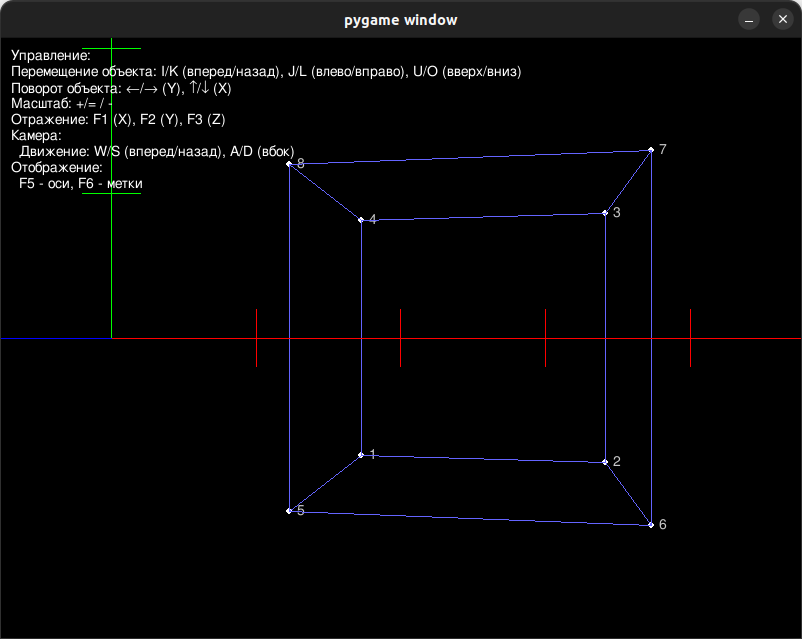

# Лабораторная работа №4 по дисциплине "Графический Интерфейс Интеллектуальных Систем"  
**Тема:** преобразования трехмерных объектов.

**Выполнил:** Глёза Егор Дмитриевич.

## Цель работы
Разработка графической программы для выполнения геометрических преобразований над трехмерными объектами:
- Перемещение (translation)
- Поворот (rotation)
- Масштабирование (scaling)
- Отражение (reflection)
- Перспектива (perspective)

Программа должна поддерживать интерактивное управление через клавиатуру, считывание координат объекта из текстового файла и использование матричного аппарата в однородных координатах.

---

## Реализованные функции
1. **Загрузка 3D-объекта из файла**  
   - Чтение координат точек из текстового файла
   - Поддержка определения граней (соединение точек)

2. **Геометрические преобразования**  
   - Перемещение объекта по осям X, Y, Z
   - Поворот вокруг осей X, Y, Z
   - Масштабирование объекта
   - Отражение относительно плоскостей XY, XZ, YZ

3. **Управление камерой**  
   - Перемещение камеры вперед/назад и в стороны
   - Перспективная проекция с настраиваемыми параметрами

4. **Отображение дополнительных элементов**  
   - Оси координат с засечками
   - Номера точек объекта

---

## Описание алгоритмов

### 1. Преобразования объекта
Все преобразования выполняются с использованием матриц 4x4 в однородных координатах.  

**Матрицы преобразований:**
- Перемещение:
$$ T = \begin{bmatrix}
1 & 0 & 0 & dx \\
0 & 1 & 0 & dy \\
0 & 0 & 1 & dz \\
0 & 0 & 0 & 1
\end{bmatrix} $$

- Поворот вокруг оси X:
$$ R_x = \begin{bmatrix}
1 & 0 & 0 & 0 \\
0 & \cos(\theta) & -\sin(\theta) & 0 \\
0 & \sin(\theta) & \cos(\theta) & 0 \\
0 & 0 & 0 & 1
\end{bmatrix} $$

- Масштабирование:
$$ S = \begin{bmatrix}
sx & 0 & 0 & 0 \\
0 & sy & 0 & 0 \\
0 & 0 & sz & 0 \\
0 & 0 & 0 & 1
\end{bmatrix} $$

- Перспектива:
$$ P = \begin{bmatrix}
1 & 0 & 0 & 0 \\
0 & 1 & 0 & 0 \\
0 & 0 & 1 & 0 \\
0 & 0 & \frac{1}{d} & 0
\end{bmatrix} $$

### 2. Управление камерой
Камера реализована через матрицу `look_at`, которая строится на основе:
- Положения камеры (`eye`)
- Целевой точки (`target`)
- Вектора "вверх" (`up`)

$$ M_{view} = R \cdot T $$
где:
- $ R $ — матрица поворота
- $ T $ — матрица трансляции

---

## Структура проекта
```
lab4/
├── main.py             # Точка входа
├── matrix.py           # Классы Point3D и Matrix
├── object.txt          # Файл с координатами объекта
└── requirements.txt    # Зависимости
```

---

## Инструкция по использованию
1. **Установка зависимостей**  
```bash
pip install -r requirements.txt
```

2. **Запуск программы**  
```bash
python main.py
```

3. **Управление объектом**  
   - Перемещение: W/A/S/D/Q/E
   - Поворот: Стрелки/PageUp/PageDown
   - Масштабирование: +/- или Numpad +/-
   - Отражение: F1/F2/F3

4. **Управление камерой**  
   - Вращение: Стрелки влево/вправо/вверх/вниз
   - Движение: W/A/S/D
   - Переключение отображения осей: F5
   - Переключение номеров точек: F6
   - Переключение невидимых линий: F7

---

## Пример работы
**Оси координат и куб:**  


---

## Математическое описание

### Однородные координаты
Каждая точка представлена в виде:
$$ P = [x, y, z, w] $$

При преобразовании:
$$ P' = M \cdot P $$

### Особенности реализации
1. **Перспективная проекция:**  
   - Используется матрица перспективы
   - Учет параметров FOV, aspect ratio, near/far planes

2. **Управление камерой:**  
   - Углы yaw и pitch определяют направление взгляда
   - Движение происходит относительно направления взгляда

3. **Отрисовка граней:**  
   - Проверка видимости точек перед отрисовкой
   - Упрощенная обработка невидимых линий

---

## Заключение
В ходе работы была разработана программа для выполнения геометрических преобразований трехмерных объектов с использованием матричного аппарата. Реализованы:
- Интерактивное управление объектом и камерой
- Поддержка различных типов преобразований
- Отображение дополнительных элементов (оси, номера точек)

Программа демонстрирует основные принципы работы с трехмерной графикой и может быть расширена дополнительными функциями, такими как:
- Загрузка сложных моделей (например, формат OBJ)
- Реализация алгоритмов удаления невидимых поверхностей
- Добавление источников света и текстур
