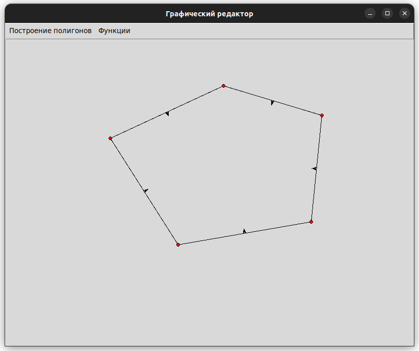

# Лабораторная работа №5 по дисциплине "Графический Интерфейс Интеллектуальных Систем"  
**Тема:** разработка графического редактора для работы с многоугольниками.

**Выполнил:** Глёза Егор Дмитриевич.

---

## Цель работы
Разработка графической программы для выполнения геометрических операций над многоугольниками:
- Проверка выпуклости
- Построение выпуклой оболочки (методы Грэхема и Джарвиса)
- Определение принадлежности точки многоугольнику
- Поиск точек пересечения отрезка со сторонами
- Визуализация внутренних нормалей

Программа должна иметь интерфейс для рисования, взаимодействия с меню и поддержку алгоритмов обработки геометрических объектов.

---

## Реализованные функции
1. **Рисование многоугольников**  
   - Добавление вершин с помощью клика мыши
   - Замыкание многоугольника при завершении ввода

2. **Геометрические операции**  
   - Проверка выпуклости (с выводом результата в консоль)
   - Построение выпуклой оболочки (выбор метода через меню)
   - Определение принадлежности точки многоугольнику
   - Поиск пересечений отрезка со сторонами

3. **Визуализация**  
   - Отображение внутренних нормалей сторон
   - Подсветка точек пересечения
   - Цветовое выделение вершин

4. **Управление**  
   - Очистка холста (ESC)
   - Выбор алгоритмов через меню

---

## Описание алгоритмов

### 1. Проверка выпуклости
- Определяется ориентация многоугольника через знак площади.
- Проверяется знак крестового произведения для последовательных векторов:
$$
\text{cross}( \vec{AB}, \vec{BC} ) \times \text{cross}( \vec{BC}, \vec{CD} ) \geq 0
$$

### 2. Внутренние нормали
- Вычисляются как перпендикуляры к сторонам:
$$
\vec{n} = \frac{(-dy, dx)}{|\vec{AB}|} \quad \text{(для против часовой)}
$$

### 3. Метод Грэхема (выпуклая оболочка)
1. Нахождение самой левой нижней точки.
2. Сортировка точек по углу от этой точки.
3. Стэк-процедура удаления вогнутых вершин.

### 4. Метод Джарвиса (выпуклая оболочка)
- Итеративный поиск "оболочки" через вращение вокруг самой левой точки.

---

## Структура проекта
```
graph_editor/
├── main.py             # Точка входа
├── gui.py              # Интерфейс
├── polygon.py          # Логика многоугольников
├── convex_hull.py      # Алгоритмы выпуклой оболочки
├── geometry_utils.py   # Геометрические функции
└── requirements.txt    # Зависимости
```

---

## Инструкция по использованию
1. **Запуск**  
```bash
python main.py
```

2. **Рисование многоугольника**  
   - Клик мыши: добавление вершины
   - ESC: очистка холста

3. **Функции через меню**  
   - **Построение полигонов**:
     - Метод Грэхема / Джарвиса
   - **Функции**:
     - Проверка выпуклости
     - Вывод нормалей
     - Проверка принадлежности точки
     - Проверка пересечения отрезка

4. **Особые действия**  
   - Проверка принадлежности точки: двойной клик после выбора функции
   - Проверка пересечения: выбор двух точек для отрезка

---

## Пример работы
**Многоугольник и нормали:**  


---

## Математическое описание

### Проверка принадлежности точки
- Используется алгоритм "стрельбы лучом":
$$
\text{count} = \text{количество пересечений луча с сторонами}
$$
- Если count четное: точка вне
- Если count нечетное: точка внутри

### Вычисление пересечений
- Для отрезков $A(x_1,y_1)B(x_2,y_2)$ и $C(x_3,y_3)D(x_4,y_4)$:
$$
t = \frac{(x_1 - x_3)(y_3 - y_4) - (y_1 - y_3)(x_3 - x_4)}{(x_1 - x_2)(y_3 - y_4) - (y_1 - y_2)(x_3 - x_4)}
$$
- Если $0 \leq t \leq 1$ и $0 \leq s \leq 1$: точка пересечения существует

---

## Заключение
Разработан графический редактор с возможностью:
- Рисования и взаимодействия с многоугольниками
- Построения выпуклой оболочки двумя алгоритмами
- Визуализации геометрических свойств (нормали, пересечения)

Дальнейшее развитие может включать:
- Добавление сохранения/загрузки многоугольников
- Реализацию анимации преобразований
- Стандартизацию формата вывода результатов

--- 

**Примечание:** Для визуализации нормалей и пересечений используйте пункты меню и клавиши в интерфейсе. Порядок вершин должен быть либо против, либо по часовой стрелке для корректной работы алгоритмов.