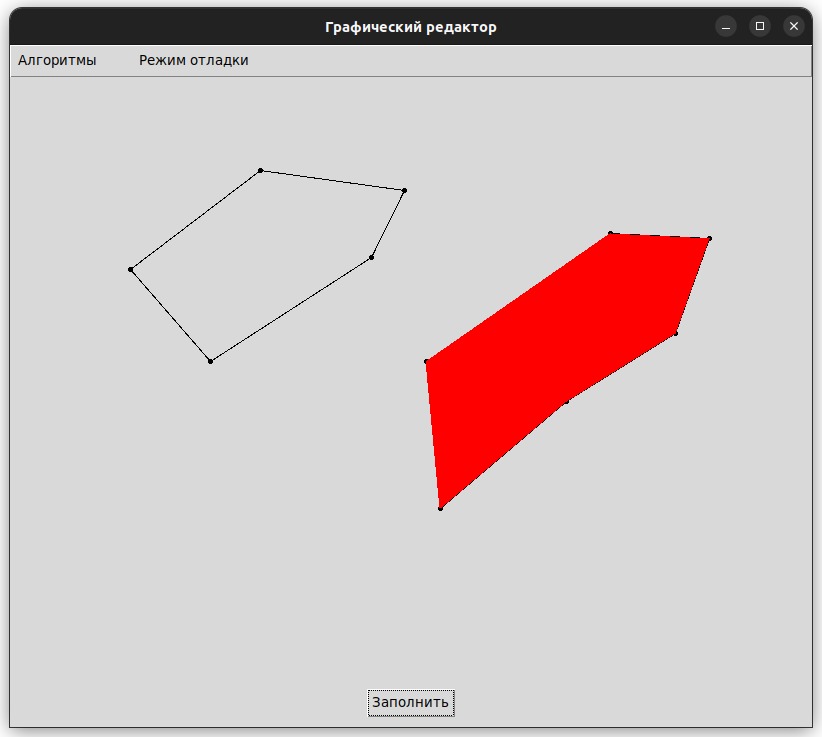

# Лабораторная работа №6 по дисциплине "Графический Интерфейс Интеллектуальных Систем"  
**Тема:** разработка графического редактора для заполнения многоугольников алгоритмами растровой развертки и затравки.

**Выполнил:** Глёза Егор Дмитриевич

---

## Цель работы
Разработка графического редактора с поддержкой алгоритмов заполнения многоугольников:
- Растровая развертка с упорядоченным списком ребер
- Затравочный алгоритм (Flood Fill)
- Построчная затравка
- Режим отладки с пошаговой визуализацией процесса

Программа должна обеспечивать рисование многоугольников, выбор алгоритмов через меню и визуализацию результатов.

---

## Реализованные функции
1. **Рисование многоугольников**  
   - Добавление вершин с помощью клика мыши  
   - Замыкание многоугольника при двойном клике  

2. **Алгоритмы заполнения**  
   - Растровая развертка с упорядоченным списком активных ребер  
   - Простая затравка (Flood Fill)  
   - Построчная затравка с анализом пересечений скан-линий  

3. **Визуализация**  
   - Отображение процесса заполнения в режиме отладки  
   - Подсветка границ многоугольников  
   - Выделение активных ребер во время растровой развертки  

4. **Управление**  
   - Выбор алгоритма через меню  
   - Включение/выключение режима отладки  

---

## Описание алгоритмов

### 1. Растровая развертка  
- **Принцип**:  
  Сортировка ребер по Y-координатам, обработка скан-линий с использованием списка активных ребер.  
- **Ключевые шаги**:  
  1. Формирование списка ребер.  
  2. Сортировка ребер по минимальной Y-координате.  
  3. Обработка каждой горизонтальной строки:  
     - Добавление новых ребер (Ymin == текущая строка).  
     - Удаление закончившихся ребер.  
     - Заполнение интервалов между парами активных ребер.  

### 2. Затравочный алгоритм (Flood Fill)  
- **Принцип**:  
  Рекурсивное/итеративное распространение цвета от начальной точки внутри многоугольника.  
- **Требования**:  
  - Начальная точка должна быть внутри многоугольника.  

### 3. Построчная затравка  
- **Принцип**:  
  Поиск интервалов пересечения скан-линий с границами многоугольника, запуск затравки в этих интервалах.  
- **Детали**:  
  - Определение точек пересечения ребер с текущей горизонтальной строкой.  
  - Группировка точек в пары для запуска локальной затравки.  

---

## Структура проекта
```
graphic_editor/
├── main.py              # Точка входа
├── gui/                 # Пакет интерфейса
│   ├── main_window.py   # Основное окно
│   └── canvas_widget.py # Виджет для рисования
├── algorithms/          # Реализация алгоритмов
│   ├── rasterizer.py    # Растровая развертка
│   ├── floodfill.py     # Затравка
│   └── line_floodfill.py# Построчная затравка
├── utils/               # Вспомогательные функции
│   └── helpers.py       # Проверки принадлежности точек, пересечений
└── requirements.txt     # Зависимости
```

---

## Инструкция по использованию
1. **Запуск**  
```bash
python main.py
```

2. **Рисование многоугольника**  
   - ЛКМ: добавление вершины  
   - Двойной ЛКМ: завершение многоугольника  

3. **Выбор алгоритма**  
   - Меню → "Алгоритмы" → выбор метода (Растровая развертка/Затравка/Построчная затравка)  

4. **Запуск заполнения**  
   - Кнопка "Заполнить" (нижняя часть окна)  

5. **Режим отладки**  
   - Включить через меню → "Режим отладки"  
   - Просмотр пошагового заполнения с паузами между шагами  

---

## Пример работы  
  

---


## Заключение
Разработан графический редактор с возможностью:  
- Визуализации процесса заполнения полигонов  
- Выбора между тремя алгоритмами  
- Просмотра пошаговых изменений в режиме отладки  

**Дальнейшие улучшения**:  
- Поддержка сохранения/загрузки многоугольников  
- Анимация заполнения без режима отладки  
- Визуализация списка активных ребер в реальном времени  

---

**Примечание**:  
- Для корректной работы алгоритмов порядок вершин должен быть либо по часовой, либо против часовой стрелки.  
- В режиме отладки скорость шагов регулируется паузой в 0.1 секунды.  
- Затравочный алгоритм требует точной начальной точки внутри полигона (автоматически выбирается центроид).