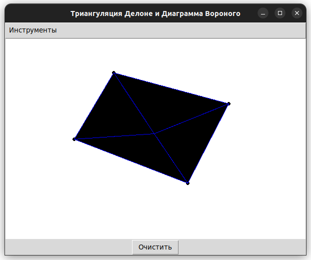

# Лабораторная работа №7 по дисциплине "Графический Интерфейс Интеллектуальных Систем"  
**Тема:** разработка графического редактора для визуализации триангуляции Делоне и диаграммы Вороного.  

**Выполнил:** Глёза Егор Дмитриевич  

---

## Цель работы  
Разработка интерфейса для визуализации геометрических структур на основе пользовательских точек:  
- Триангуляция Делоне  
- Диаграмма Вороного  

Программа должна обеспечивать добавление точек, выбор типа визуализации через меню и очистку рабочей области.  

---

## Реализованные функции  
1. **Рисование точек**  
   - Добавление точек щелчком мыши.  
   - Отображение точек на канвасе.  

2. **Визуализация структур**  
   - Триангуляция Делоне: полигональные элементы синего цвета.  
   - Диаграмма Вороного: отображается в отдельном окне через matplotlib.  

3. **Управление**  
   - Очистка канваса через кнопку "Очистить".  
   - Выбор типа визуализации через меню "Инструменты".  

---

## Описание алгоритмов  

### 1. Триангуляция Делоне  
- **Принцип**:  
  Автоматическое создание треугольной сетки, максимизирующей минимальный угол.  
- **Технологии**:  
  - Библиотека `matplotlib.tri` для построения сетки.  
  - Отображение через `tkinter.Canvas` с помощью полигональных примитивов.  

### 2. Диаграмма Вороного  
- **Принцип**:  
  Разбиение плоскости на области, ближайшие к каждой исходной точке.  
- **Технологии**:  
  - Библиотека `scipy.spatial` для вычисления структуры.  
  - Визуализация через `matplotlib.pyplot`.  

---

## Структура проекта  
```
.
├── pyproject.toml
├── README.md
├── src
│   ├── app.py
│   └── main.py
└── uv.lock 
```  

---

## Инструкция по использованию  
1. **Запуск**  
```bash  
python main.py  
```  

2. **Добавление точек**  
   - ЛКМ: создание новой точки.  

3. **Выбор визуализации**  
   - Меню → "Инструменты" → "Триангуляция Делоне" или "Диаграмма Вороного".  

4. **Очистка**  
   - Кнопка "Очистить" для удаления точек и фигур.  

---

## Пример работы  
  
*Пример: триангуляция Делоне для 5 точек.*  

---

## Заключение  
Разработан редактор с возможностью:  
- Динамического добавления точек.  
- Визуализации триангуляции Делоне и диаграммы Вороного.  
- Очистки рабочей области.  

---

**Примечание**:  
- Для корректной работы триангуляции и диаграммы Вороного требуется минимум 3 точки.  
- Диаграмма Вороного отображается в отдельном окне matplotlib.  