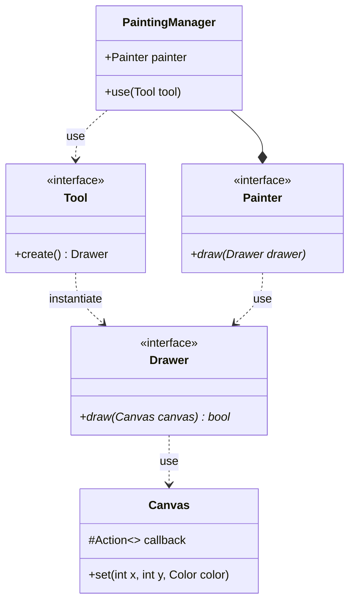

```mermaid
classDiagram
    class Canvas{
        #Action~~ callback
        +set(int x, int y, Color color)
    }

    class Drawer{
        <<interface>>
        +draw(Canvas canvas) bool* 
    }
    Drawer ..> Canvas: use

    class Tool{
        <<interface>> 
        +create() Drawer
    }
    Tool ..> Drawer: instantiate

    class Painter{
        <<interface>>
        +draw(Drawer drawer)*
    }
    Painter ..> Drawer: use

    class PaintingManager{
        +Painter painter
        +use(Tool tool)
    }
    PaintingManager --* Painter
    PaintingManager ..> Tool: use
```