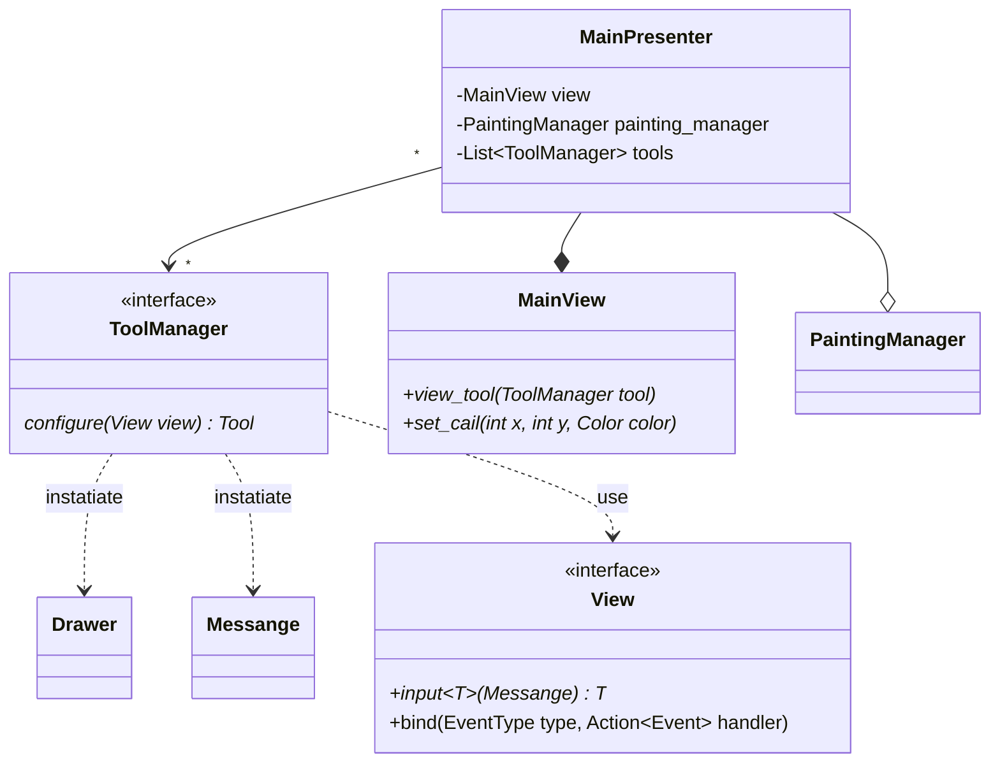

```mermaid
classDiagram
    class View{
        <<interface>>
        +input~T~(Messange) T*
        +bind(EventType type, Action~Event~ handler)
    }

    class ToolManager{
        <<interface>>
        configure(View view) Tool*
    }
    ToolManager ..> Drawer: instatiate
    ToolManager ..> Messange: instatiate
    ToolManager ..> View: use

    class MainView{
        +view_tool(ToolManager tool)*
		+set_cail(int x, int y, Color color)*
    }

    class MainPresenter{
        -MainView view
        -PaintingManager painting_manager
        -List~ToolManager~ tools
    }
    MainPresenter --* MainView
    MainPresenter --o PaintingManager
    MainPresenter "*" --> "*" ToolManager
```