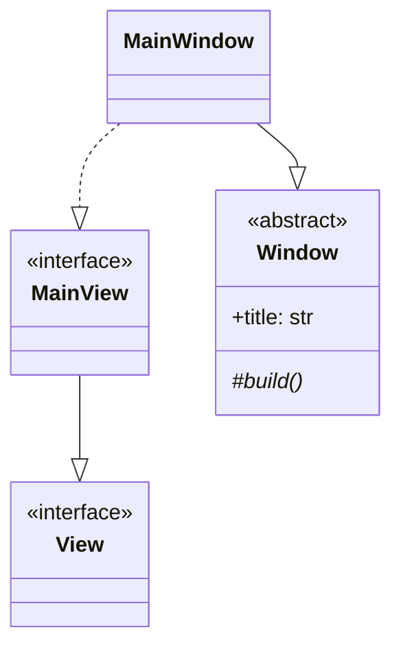

```mermaid
classDiagram
	class View{
		<<interface>>
	}

    class MainView{
        <<interface>>

    }
	MainView --|> View

	class Window{
		<<abstract>>
		+title: str
		#build()*
	}
	
	class MainWindow{
	
	}
	MainWindow --|> Window
	MainWindow ..|> MainView
```
