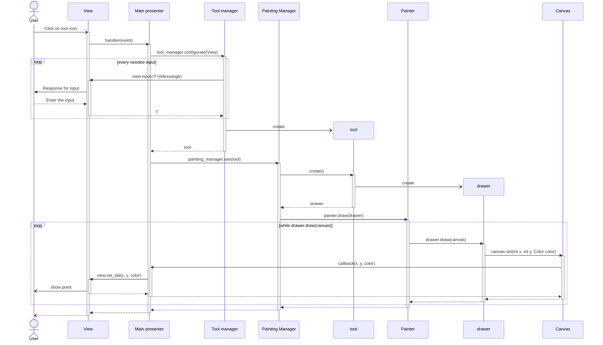

```mermaid
sequenceDiagram
    actor U as User
    participant V as View
    participant Pr as Main presenter
    participant TM as Tool manager
    participant PM as Painting Manager

    U -) V: Click on tool icon
    activate V
        V ->> Pr: handler(event)
        activate Pr
            Pr ->> TM: tool_manager.configurate(View)
            activate TM
                loop every needed input
                    TM ->> V: view.input<T>(Messange)
                    activate V
                        V ->> U: Response for input
                        U -->> V: Enter the input
                        V -->> TM: T
                    deactivate V
                end
                create participant t as tool
                TM -) t: create
                TM -->> Pr: tool
            deactivate TM
            Pr ->> PM: painting_manager.use(tool)
            activate PM
                participant P as Painter
	            PM ->> t: create()
	            activate t
		            create participant d as drawer
		            t -) d: create
		            t -->> PM: drawer
	            deactivate t 
                PM ->> P: painter.draw(drawer)
                activate P
                    loop while drawer.draw(canvas)
                        P ->> d: drawer.draw(canvas)
                        activate d
                            participant C as Canvas
                            d ->> C: canvas.set(int x, int y, Color color)
                            activate C
                                C ->> Pr: callback(x, y, color)
                                activate Pr
                                    Pr ->> V: view.set_tail(x, y, color)
                                    activate V
                                        V -) U: show point
                                        V -->> Pr: 
                                    deactivate V
                                    Pr -->> C: 
                                deactivate Pr
                                C -->> d: 
                            deactivate C
                            d -->> P: 
                        deactivate d
                    end
                    P -->> PM: 
                deactivate P
                PM -->> Pr: 
            deactivate PM
            Pr -->> V: 
        deactivate Pr
        V --) U: 
    deactivate V
```
