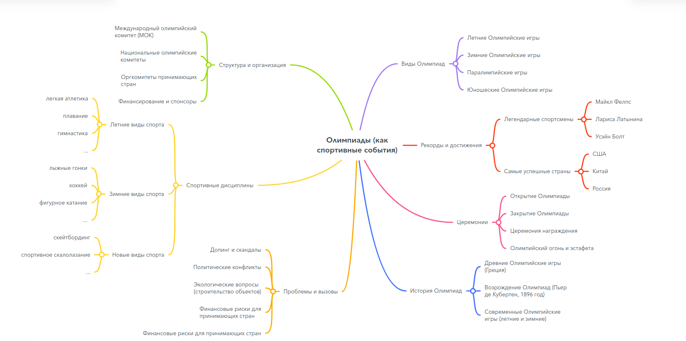
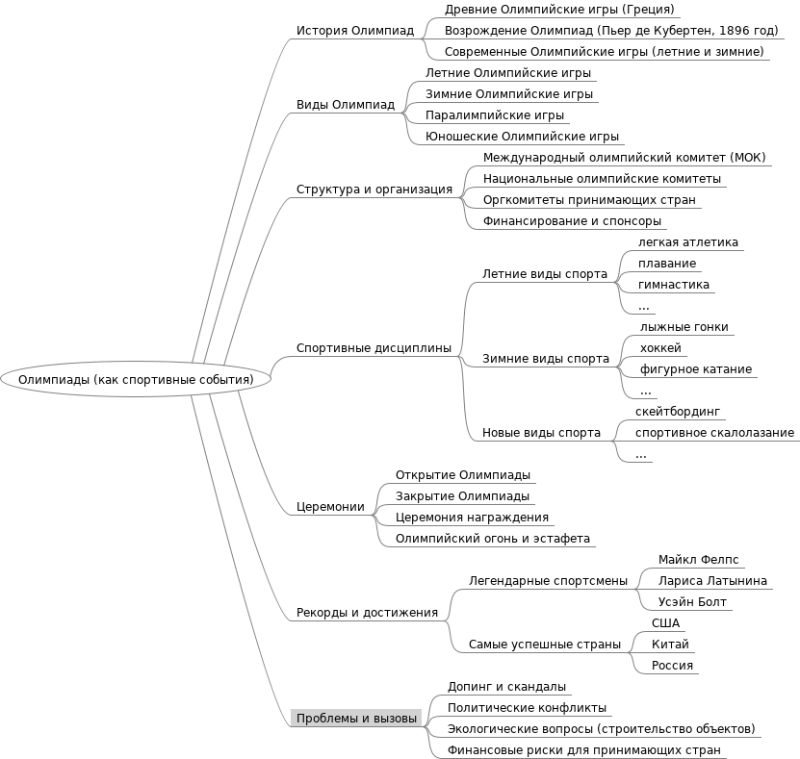

# Отчёт

## Лабораторная работа №1 по дисциплине "Проектирование баз знаний"

### Выполнил: Глёза Егор Дмитриевич

#### Вариант 2: Олимпиады (как спортивные события) 

##### Основные разделы
1. История Олимпиад
    - Древние Олимпийские игры (Греция)
    - Возрождение Олимпиад (Пьер де Кубертен, 1896 год)
    - Современные Олимпийские игры (летние и зимние)

2. Виды Олимпиад
    - Летние Олимпийские игры
    - Зимние Олимпийские игры
    - Паралимпийские игры
    - Юношеские Олимпийские игры

3. Структура и организация
    - Международный олимпийский комитет (МОК)
    - Национальные олимпийские комитеты
    - Оргкомитеты принимающих стран
    - Финансирование и спонсоры

4. Спортивные дисциплины
    - Летние виды спорта (легкая атлетика, плавание, гимнастика и др.)
    - Зимние виды спорта (лыжные гонки, хоккей, фигурное катание и др.)
    - Новые виды спорта (скейтбординг, спортивное скалолазание и др.)

5. Церемонии
    - Открытие Олимпиады
    - Закрытие Олимпиады
    - Церемония награждения
    - Олимпийский огонь и эстафета

7. Рекорды и достижения
    - Легендарные спортсмены (Майкл Фелпс, Лариса Латынина, Усэйн Болт)
    - Самые успешные страны (США, Китай, Россия)
    - Знаковые моменты в истории Олимпиад

8. Проблемы и вызовы
    - Допинг и скандалы
    - Политические конфликты
    - Экологические вопросы (строительство объектов)
    - Финансовые риски для принимающих стран

##### Визуальное отображение в MindMeister

##### Визуальное отображение в FreeMind

##### Сравнение MindMeister и FreeMind

| Критерий          | MindMeister                              | FreeMind                                 |
|-------------------|------------------------------------------|------------------------------------------|
| Тип ПО            | Веб-сервис + мобильные приложения        | Десктопное приложение (только для ПК)    |
| Онлайн/Офлайн     | Онлайн с возможностью офлайн-доступа     | Только офлайн                            |
| Платформы         | Windows, macOS, iOS, Android, веб-браузер| Windows, macOS, Linux                    |
| Языки интерфейса  | Многоязычный (включая русский)           | Многоязычный (русский поддерживается)    |
| Совместная работа | ✔ Режим реального времени, комментарии,   история изменений, роли доступа | ✖ Нет поддержки |
| Шаблоны           | ✔ Готовые шаблоны для разных задач       | ✖ Нет шаблонов                           |
| Интеграции        | ✔ MeisterTask, Slack, Google Drive, Dropbox | ✖ Нет интеграций                      |
| Мультимедиа       | ✔ Вставка изображений, ссылок, видео     | ✖ Только текст и гиперссылки             |
| Стилизация        | ✔ Цветовые темы, иконки, форматирование  | ✔ Базовое форматирование (цвета веток)   |
| Экспорт           | ✔ PDF, PNG, Word, PowerPoint, текстовые форматы | ✔ HTML, PDF, PNG, XMind, текстовые форматы |
| Импорт            | ✔ Поддержка форматов: MindManager, XMind | ✔ Поддержка форматов: Freemind, XMind    |
| Интерфейс         | ✔ Современный, интуитивный, drag-and-drop| ✔ Простой, но устаревший интерфейс       |
| Кривая обучения   | Низкая (подходит новичкам)               | Средняя (требует привыкания)             |
| Настройки         | Гибкие настройки веток, шрифтов, стилей  | Минимальные настройки                    |
| Бесплатная версия | ✔ До 3 карт, ограниченные функции        | ✔ Полностью бесплатен                    |
| Платные тарифы    | ✔ От $5.99/месяц | ✖ Нет платных версий |
| Лицензия          | Проприетарное ПО                         | Открытое ПО (GPL)                        |

| Инструмент        | Плюсы                                   | Минусы                                  |
|-------------------|-----------------------------------------|-----------------------------------------|
| MindMeister       | - Совместная работа в реальном времени - Современный дизайн - Интеграции с другими сервисами - Мобильные приложения | - Ограничения в бесплатной версии - Требует интернет для полной функциональности |
| FreeMind          | - Полностью бесплатный - Работает офлайн - Подходит для простых карт | - Устаревший интерфейс - Нет мультимедиа и совместной работы - Минимальная поддержка |

**MindMeister**:  
- Команды, которым нужна совместная работа.  
- Те, кто ценит современный дизайн и интеграции.  
- Пользователи, готовые платить за расширенные функции.

**FreeMind**:  
- Одиночные пользователи с ограниченным бюджетом.  
- Те, кому нужна простая офлайн-программа.  
- Поклонники open-source.