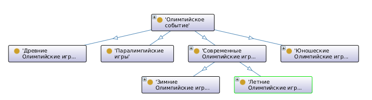

# Лабораторная работа №2 по дисциплине "Проектирование баз знаний"  
**Тема:** Разработка  онтологии предметной области

**Выполнил:** Глёза Егор Дмитриевич  

**Вариант 2:** Онтология предметной области "Олимпийские игры"  

## Описание предметной области
**Основные сущности:**  
- Олимпийские события (летние/зимние, древние/современные)  
- Страны-участницы и их медальные показатели  
- Спортивные дисциплины (летние/зимние виды)  
- Спортсмены и их рекорды  
- Организации (МОК, национальные комитеты)  
- Проблемы (допинг, политические конфликты)  

## Структура онтологии
### Классы
| Класс                | Описание                                                                 |
|----------------------|--------------------------------------------------------------------------|
| `OlympicEvent`       | Базовый класс для всех олимпийских событий                               |
| `AncientOlympics`    | Игры в Древней Греции (776 г. до н.э. – 393 г. н.э.)                     |
| `ModernOlympics`     | Современные игры (с 1896 г.)                                             |
| `SummerOlympics`     | Летние Олимпийские игры                                                  |
| `WinterOlympics`     | Зимние Олимпийские игры                                                  |
| `Paralympics`        | Игры для спортсменов с инвалидностью                                     |
| `YouthOlympics`      | Юношеские игры (14-18 лет)                                               |
| `SportDiscipline`    | Спортивные дисциплины (категоризированы через SKOS)                      |
| `Athlete`            | Спортсмены (наследуют класс `foaf:Person`)                               |
| `Country`            | Участвующие страны с медальным зачётом                                   |
| `Organization`       | Организации (МОК, спонсоры)                                              |
| `Problem`            | Проблемы (допинг, экология, политика)                                    |

### Свойства
**Объектные свойства:**  
- `hostedBy` (связь события со страной)  
- `participatesIn` (участие спортсмена в событии)  
- `hasDiscipline` (включение дисциплин в события)  
- `sponsoredBy` (спонсорская поддержка)  

**Свойства данных:**  
- `year` (год проведения)  
- `medalCount` (количество медалей у страны)  
- `ageRestriction` (возрастные ограничения)  

### Внешние онтологии
- **FOAF**: Для описания людей (`Athlete`) и организаций  
- **SKOS**: Для категоризации спортивных дисциплин  

## Примеры экземпляров
### События
- `Tokyo2020` (Летняя Олимпиада, 2021 г., Япония)  
- `Beijing2022` (Зимняя Олимпиада, 2022 г., Китай)  

### Спортсмены
- `MichaelPhelps` (23 золотые медали)  
- `SimoneBiles` (чемпионка по гимнастике)  

### Организации
- `IOC` (Международный олимпийский комитет)  
- `Toyota` (спонсор Токио-2020)  

## Визуализация в Protégé
  
*Фрагмент иерархии классов в Protégé с аксиомами*

## Преимущества и недостатки Protege
**Плюсы:**  
- Поддержка OWL и RDF  
- Визуализация иерархий классов  
- Интеграция с внешними онтологиями (FOAF/SKOS)  
- Возможность создания сложных SPARQL-запросов  

**Минусы:**  
- Высокая кривая обучения  
- Ограниченные возможности для совместной работы  

## 6. Выводы
- Онтология охватывает ключевые аспекты Олимпийских игр.  
- Для анализа данных рекомендуется использовать **SPARQL-запросы**.  
