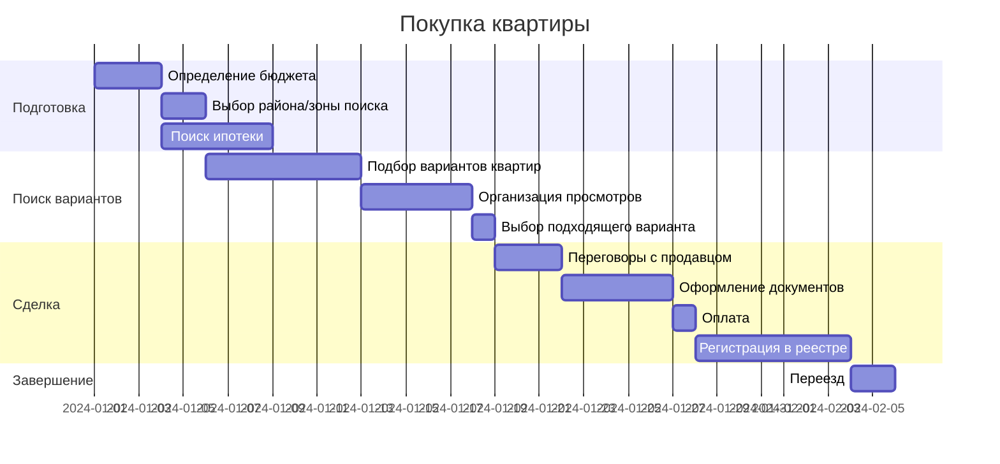

# Лабораторная работа №3 по дисциплине "Проектирование баз знаний"  
**Тема:** Разработка диаграммы Ганта для планирования проекта.

**Выполнил:** Глёза Егор Дмитриевич.

**Вариант 2:** Покупка квартиры.
## Диаграмма Ганта

## Описание задач

### 1. Подготовка
- **Определение бюджета** (3 дня)  
  Анализ финансовых возможностей, расчет доступной суммы с учетом сбережений и ипотеки.

- **Выбор района/зоны поиска** (2 дня)  
  Определение предпочитаемого района проживания с учетом инфраструктуры, транспорта и личных предпочтений.

- **Поиск ипотеки** (5 дней)  
  Сравнение условий банков, подача заявки, получение одобрения.

### 2. Поиск вариантов
- **Подбор вариантов квартир** (7 дней)  
  Поиск через агентства, сайты объявлений, анализ вариантов по параметрам.

- **Организация просмотров** (5 дней)  
  Координация времени с продавцами/риелторами, осмотр объектов.

- **Выбор подходящего варианта** (1 день)  
  Принятие решения на основе просмотров и анализа.

### 3. Сделка
- **Переговоры с продавцом** (3 дня)  
  Согласование цены, условий оплаты и сроков.

- **Оформление документов** (5 дней)  
  Проверка юридической чистоты квартиры, подготовка договора купли-продажи.

- **Оплата** (1 день)  
  Внесение задатка или полной суммы в зависимости от договоренностей.

- **Регистрация в реестре** (7 дней)  
  Подача документов на государственную регистрацию права собственности.

### 4. Завершение
- **Переезд** (2 дня)  
  Организация перевозки вещей, смена прописки, подключение коммунальных услуг.

## Зависимости задач
- Ипотека запускается параллельно с выбором района, чтобы ускорить процесс.
- Регистрация сделки зависит от оплаты, а переезд — от регистрации.
- Оформление документов возможно только после согласования условий с продавцом.